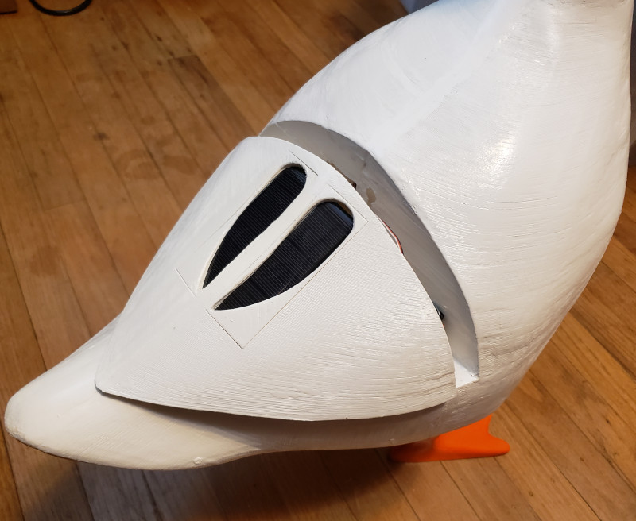

# Goose Statue

Garden statue that will honk on you if you get closer. Optimized to be powered by solar panels and
the power harvester, which will power the controller and sound amplifier only when the voltage in
the storage (supercondensators) is enough.

I use 2x7v semi-closed solar panels and 4x2.5V supercondensers which works fine for sunny places.

The firmware is based on arduino, uses samd21 DMA DAC on A0 to sound like a goose. The wav files
are converted by audio2huff to header files which are included to the firmware. Most of the time
the MK is sleeping, but wake up on IR signal and checks for 5 seconds that the signal is here -
means someone close by and need to be honked.

## Components

* [Seeeduino XIAO Microcontroller](https://www.amazon.com/dp/B08745JBRP)
* 2x [7V 50mA Poly Mini Solar Cell Panel Module 93.1mm x 30mm](https://www.amazon.com/dp/B073Y4M97R)
* 1x [PAM8302 2.5W Class D Single Channel Audio Amplifier](https://www.amazon.com/dp/B07XP8C1N9)
* 1x [4 Ohm 3 Watt Speaker 11mm](https://www.amazon.com/dp/B08JCHK7GR)
* 1x [LTC3588 Energy Harvester Breakout](https://www.amazon.com/dp/B01MRLN1LD)
* 2x [PIR AM312 Mini Human Sensor Module DC 2.7V to 12V](https://www.amazon.com/dp/B08PVB7VHQ)
* 4x Super Capacitors 10F 2.5V - main solar storage
* 1x Super Capacitor 5.5V 1.5F - additional storage to power audio amplifier
* 1x Electrolythic capacitor 50V 100nF - stabilizer of voltage for MK
* Power switch - cut-off power for amplifier & MK
* 3-pos switch - choose the PIR signal to use (Left, Right or both)

## How to build

Regarding the electronic components - check the svg schema here: [schema.svg](schema.svg).

Just open the blend file, make sure you sliced the goose according to your printer build volume,
print it out, glue and polish, make some hinge mechanism (to keep the back part attached),
spray-paint the body, spray-varnish it a bit and you should be good.

The eyes are IR sensors - so if you will just pain them with your black sharpie and spray-varnish -
it will not affect the IR but will look just great :)

Also would recommend to have a standing stick or make a platform - although the goose is balanced,
wind can affect the balance anyway...
